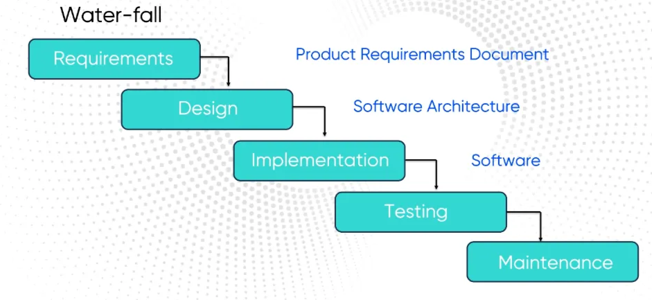
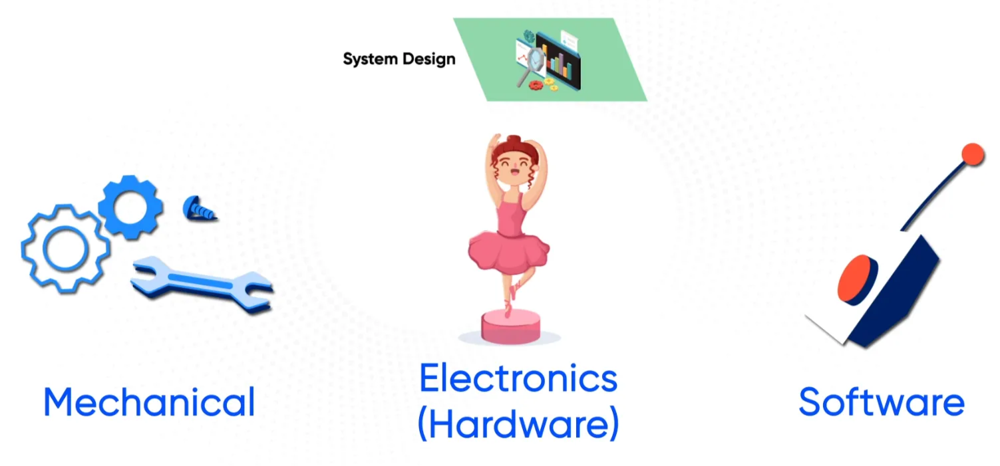
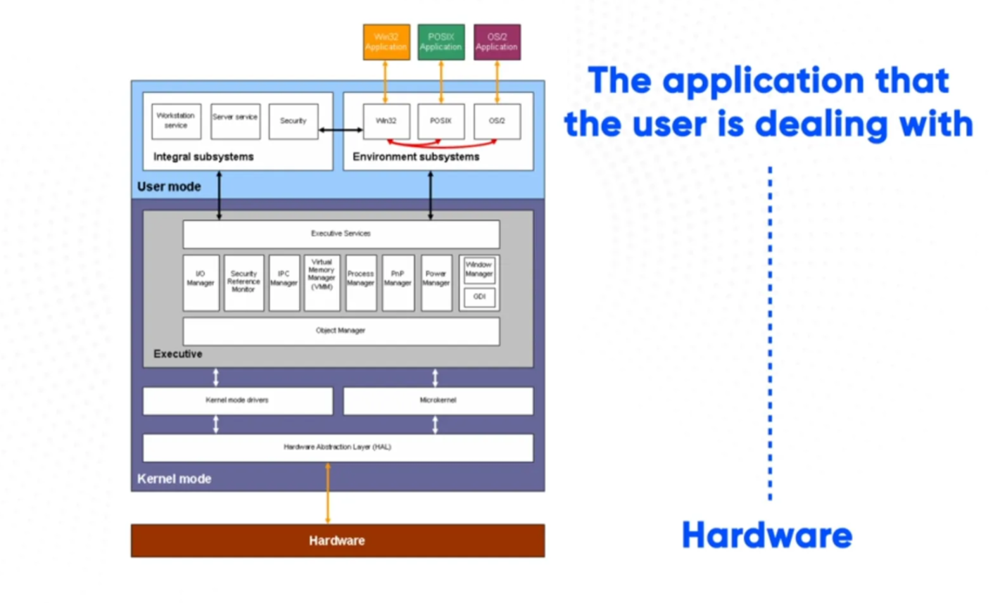
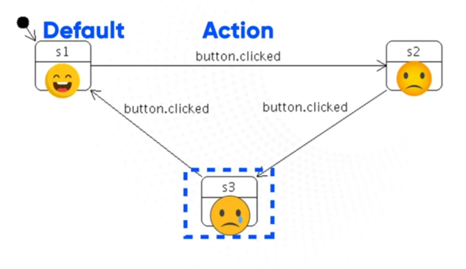
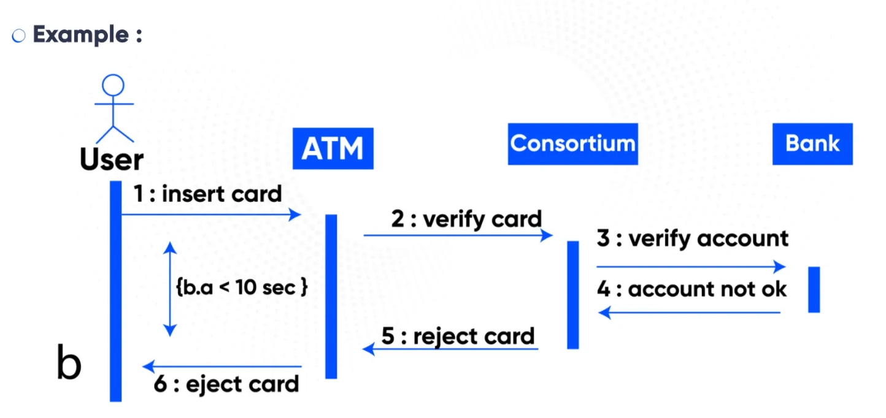
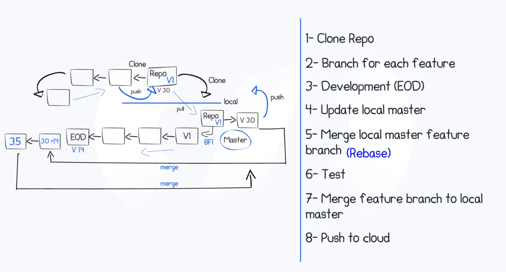
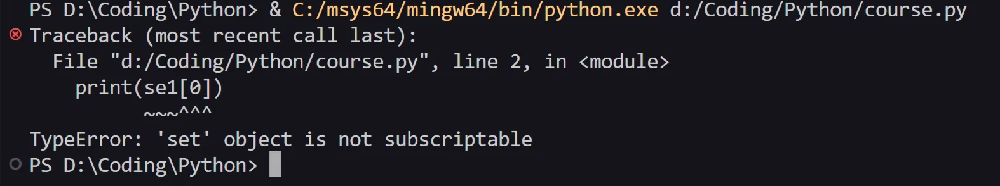

# Sprints Course

# Introduction to Software Engineering

## Why did emerge it?

- it appeared in 1960s due to:
    - complexities of SW projects increases as HW capability increases
    - larger SW system is more difficult
    - Demand for new SW increased faster than the ability to generate new SW
    - Produced SW did not satisfy the customer requirements

<aside>
💭

Because of the software crises the term software engineering first appeared.

</aside>

### Industry Challenges

- cost of SW failure can be massive due to live risk
- As the market demands increase, we need SW that can keep up with the rapid development
- increased complexity of SW due new applications
- Diversity of SW systems communicating with each

## What characteristics should be covered to make perfect SW

### Operational

- Functionality-base of the SW

| Correctness  | Meet the customer’s Specifications  |
| --- | --- |
| Usability  | Easy to use |
| Efficiency  | Execution time , resources usage |
| Security  | Data and hardware |
| Safety | Not Hazardous to environment/life |

### Transitional

- Attributes related to working with different applications

| Interoperability  | Ability to exchange information with other applications  |
| --- | --- |
| Reusability | Use SW for different Purposes  |
| Portability  | Ability of SW to work across Platforms like different Operating Systems like IOS/Android |
- Of course there would be an effort when using an application for another platforms so when the effort decrease the Portability increase

### Maintainable

- refers to the internal quality of SW as it has ability to be improved smoothly and easily without introducing new bugs

| Flexibility  | Easy to change SW |
| --- | --- |
| Extensibility | Easy to add features |
| Scalability  | Ability to accommodate more users, or more workload. |
| Testability | Ability to test SW  you can add things in the SW to help you detect bugs while testing  |
| Modularity  | Dividing programs into different modules to make it easier to deal with |

## Software Development Life Cycle (SDLC)

### Waterfall



- the first and oldest SDLC made for SW producing
- it moves from one stage to the next without returning to earlier stage
- it goes through multiple stages :
    - Requirements
    - Analysis
    - Design
    - Coding
    - Testing
    - Acceptance
- Testing stage vs. Acceptance
    - the difference is Acceptance stage is applied in a realistic conditions unlike Testing

### V-Model


- appeared because :
    - Waterfall model takes time
    - Testing was at a late stage
        - rework
        - increased budgets
        - longer project duration
- Developer’s Life Cycle
    - Requirement Analysis
    - Design it is divided into 3 stages in this SDLC
        - System Design
            - Designing the system as a whole
            
            
            
        - Architecture Design
            - it is designing the layers of the software
                - Lower layers usually deals with hardware while going up it started dealing more with users
        - Module Design
            - Designing each module on its own
    - Coding
    - Testing
        - Unit/Module Testing
            - Testing each Unit/Module on it is own before implementing it on the final SW
        - Integration Testing
            - in this stage we start integrating some Units/Modules together and then Testing
            - usually it is an incremented Process : we don’t implement all Modules at once, instead , we get 2 or 3 modules together and start testing
        - System Testing
            - In this phase, we finally test the SW as a whole and if there is any mechanical parts or hardware it show up and be tested in this stage
    - Acceptance Testing
        - Testing The SW in a more realistic Conditions
- PROs
    - Reduce risk
    - Save on Schedule

those PROs happen because each adjacent stage happen a bit together like

acceptance tester will be there while being informed about Requirement 

Tester will be there with designer this one supports Testability

### Iterative Model

- instead of delivering the customer the final project, we will deliver it on a short agreed period of time. which gave us and edge to figure out any misunderstanding for requirement which helped avoid reworking
- it also gives more flexibility for the customer to modify his requirements.
- the team is focusing on some features. instead of the SW as a whole

## Software Design

- it is the most important activity, it is placed before the coding stage that is why any error that happen in this phase will affect the whole SW
- Design Levels
    - Architecture
        - Define the SW as components in different layer and start working on each component.
    - High-Level Design
        - The Define the interactions between different Layer.
    - Detailed Design/Low-Level Design
        - Defines logical structure of each component
- That helps us when we reach implementation/coding stage, so the coder know the role of each component and when to share data with other components

### Why Software Design?

- Enable multiple developers to work in parallel
- Smaller components are easier to maintain
- Ensures better software performance
- Desired level of abstraction can be bought in the program
    - Ex, if we change the hardware the only thing needs change is the first layer of the SW.
- Components with high cohesion can be re-used again
- Concurrent execution can be made possible
- Ensure security objectives are met

### Design Choices

- At this stage we make choices that involve decisions like :
    - Is it in Front-end or Back-end?
    - Is it gonna be divided into 4 components or 10 components?
    - What kind of coding languages we will use?

### Cohesion Vs Coupling

| Cohesion | Coupling  |
| --- | --- |
| The degree of intra-dependability within elements of a module  | The degree of intra-dependability among modules of a program  |
- when Cohesion is ⬆️ and Coupling is ⬇️
    - Good Design
    - Good Performance
    - Use components elsewhere
    - Know what the bugs is with any component and how to fix it
- when Cohesion is ⬇️ and Coupling is ⬆️
    - it reduces the SW reusability

### Font End vs Back End

- Front-End is the Client-Side:
    - it is everything the user sees and interacts with
- Back-End is the Server-Side:
    - It’s the machinery that works behind the scenes to power those fancy features users interact with on the client-side

### Native Development Vs Hybrid Development

- Native Development
    - The Native Language to code with
    - EX, you are developing and application that will be published on IOS and Android
        - Android : in this case you will have to use Java
        - IOS : so you will have to use swift
- Hybrid Development
    - I’m not using the native language instead I’m using another language can be used on multi-platform
    - in this case it is like Flutter that use the Dart language
        - so in this case i made one program that can be used on Android and IOS

| **Hybrid Development**   | **Native Development**  |
| --- | --- |
| developing the SW one time which leads to  | Faster Performance  |
| Lower Cost | Better User Experience  |
| Saves Time | Easier to access to device’s hardware |
| IF a bug occurs, you will solve it once in one language  |  |

<aside>
💭

accessing device’s hardware started to be easier on Hybrid and the number of application using hybrid is increasing too, and the gap between Native and hybrid in performance started to close. but still the big names still use native Developments.  So if u are on a tight budget go with Hybrid Development, if not it is still recommended to go with Native Development. 

</aside>

## Application Programming Interface  API

- Applications/SW Communicate with each other without any knowledge or intervention from the user.
- Why was an API created?
    - It is used to give access to different application which leads to more expansion

## Software Diagrams

- it is a tool needed by :
    - SW Designers
    - SW Developers
    - Product Owners
    - anyone who describe the SW or even test it
- Examples of SW Diagrams :
    - Description of the program as a whole
    - Describe a specific functionality in the program
    - Description of the relationship between the user and SW
- it is an important tool to simplify the communication between stakeholders

### Block Diagram



- It’s a diagram filled with blocks. those blocks are in a layer-shape, each block describes one component or  a group of components.
- the main concept of the block diagram is when u go DOWN u get closer  to the Hardware and when u go UP You get closer to The application that the user is dealing with.
- It is the best tool to explain High-Level Design and Architecture of SW.

### State-Machine Diagram



- it is used to show the states of the SW and Actions
- in this program there is 3 states : Smiley Face , Neutral Face , Crying Face

### Flow Chat


- it is a bit like the State-Machine Diagram but it shows more details on the actions and how the SW works
- That is why is it closer to the implementation state

### Sequence Diagram



- It is used to describe the Sequence of events.
- It is a communication process between different parties.
- In that Example it shows the process and the series of events also it shows this whole process should take less than 10 sec.

# Software Configuration Management

## What is Software Configuration Management SWCM ?

- Configuration Management job is change management ,Defects Management and release management, and it set some regulations and standards helping teams to produce a mature SW.
    - Change Management  : to be able to trace and manage the changes in requirements, which lets you know which teams working on which change
    - Defects Management  : to track the issues to figure out which issue occurred ‘cause of which requirement, and which test case were triggering this issue
    - Release Management  : it is the stage that decide which group of requirements will be in the first and the later releases
- That’s why we are saying CM is the heart of the SDLC, because it saves us from lots of mess.

### How to Software Configuration Management ?

1. Identify Configuration Items
    1. source code
    2. Design Documents
    3. Testing Documents or Testing Scripts 
    4. Automation Scripts
2. Change Control  
    1. track & control changes that are done to configuration items
3. Configuration Status Accounting 
    1. Tracks Change Requests
    2. Tracks each Release 
4. Configuration Audit & Review 
    1. Validation of Completeness & Consistency 
        - It ‘s the process that tells me what to review and what to perform internal audit on to make sure everything is working perfectly

### Software Configuration Management Tools

- the tools should handle the concurrent work
- it should provide synchronization
    - to help us check in and check out without overwriting the work
- version control
    - to have the history of the identified items
    - and track the changes occurred on the code and by who

## What is Version Control VC ?

- it is controlling the released versions came from the different configuration items we made in Configuration Items Activities
- it help us to cover those 3 important things
    - Concurrency Management
        - Two or more are working at the same time
    - Synchronization
        - Repositories Checkout
        - Change - Repository Merge back in
    - Version Control
        - Track Changes
        - Keep History

### Centralized VC Systems vs Distributed VC Systems


- Centralized VC Systems
    - A Client-Server approach, repo is at one place and provides access to different users.
    - every user get is a copy on his local mach9ine and then check-out from the main repo and then check-in again to upload the changes
    - the merging process happens on the main repo which makes it a bit slow, ‘cause if someone is merging u got to wait till he finishes

- Distributed VC Systems
    - Every user has a local copy of the repository in addition to the central repo on the server side.
    - you will work and updates on the local copy and when u finish everything u got to push it back to the main repo
    - which makes the merging process faster because u merging when u finish

| **Centralized VC Systems** | **Distributed VC Systems** |
| --- | --- |
| Easy to understand  | Complex Process |
| Slower | Faster |
| Depends on the server | Work Locally  |
| Needs Internet Connectivity  | Can work Offline except for push / pull |
| Hard to merge | Easier to merge |

## What is Git & GitHub ?

- Git
    - Distributed version control tool for tracking changes in Source Code during software development
    - installed Locally
    - Focuses on Version Control

- GitHub
    - Cloud-based platform built around Git to host the repos
    - Hosted in the Cloud
    - Focused on Centralized source
- when we add  git int  to a file it get the access by git


- there is 3 stages when uploading the changes
    - W.C
        - it is the stage where you are working on the files, add features and fix bugs
    - Staging
        - this is a stage between working and committing. is it useful? yes, is is
            - because it help u divide files and fixes you are working on into multiple commits. which will help you if there is an issue to figure out where did it happen and revert it alone. and it is the best practice
    - Commit
        - it is the stage where things you worked on is pushed to the repo
        - that number in commit is a number assigned to the version u made when u move it from staging to commit
        - you can also use `-m`  to add a comment to make things organized and easier to work with and fix


imagine u cloned a repo and now u have it on your device, let’s say u kept working on the code but by accident u pushed the edits before it is finished. the main repo on the cloud will be modified with the unfinished code.

so the better approach is to make a branch out of the local repo. which is helpful to avoid pushing your local repo and modify the main repo on the cloud by accident. 

if u ever push a branch, you will have it created as a branch on the main repo on the cloud with the same name as your branch and has the edits you made. It is separated from it so even if someone pull the main repo it won’t have that branch edits . whatever, they can still pull that branch but it is not like cloning the repo with a wrong code.

what if i want to add the edits to the main code? you will have to get back the master branch and then push it to the repo. so you will have to  push the branch you made to the master branch and then push it to the repo on cloud.

### Git Workflow



When u first start your project, you have to clone the repo on your local machine. Then to avoid pushing uncompleted feature to the cloud you got to make a branch for each feature. by the time you finish developing the feature, Someone may have finished another feature and modified the main repo with it. SO you have to pull the changed to your own local repo, and then merge the new local master with the feature branch this process is called Rebase, after rebasing you have to test your feature with the SW and when this stage is done, you are ready to merge the feature branch to local master and push to cloud.

### git basic commands

- `get init`  is used to make a repo inside the folder
- `git config — global <what you want to change>`  is used to change things like your email and name which are shown when u do anything on the project
- `git status` it shows the status of the repo or project currently
- `git add`  is used to add file into staging from working-copy
- `git log` shows the history of things you made
- `git restore` is used to discard the edits on the working copy immediately
- `git restore -staged` gets your files from staged into the Working-copy again
- if u want to get from commit to staging, `git revert` gets in handy, all you have to do is to use `git revert` forwarded with the commit number of the commit you want to revert.
    - NOTE : this change won’t be shown when you use `git status` but it modify the file and logged in the history so u can see it when u use the `git log`
- `git branch` this command is used for multiple purposes, if it is used stand alone it gonna show you the branches you have and the one u currently uses will have `*` behind it.
- if you want to create a new branch `git branch` will be in use once again but this time forwarded with the name you want for the branch.
- in case you want to change between branches `git checkourt <name of the branch>` will be your friend.

<aside>
💭

when you make changes inside a branch and then switch to another one, you want see those edits till you merge it 

</aside>

- ok so here comes the question, How to merge the changes?
    - easy, all you have to do is to switch to the destination you want to merge the changes in and use this command `git merge <the name of the branch that has the changes>` and that is it.\
- you may need to push the branch itself in case someone wants to work with you on it or he wants to copy something from it.
    - so when that happen, the first time you want push the branch you need to link were it is going to be pushed using `git push —set-upstream origin  <name of the branch>` , after that one time you will just use this command `git push origin <name of the branch>`.
- How to rebase?
    - rebase is literally merging but instead of merging the the feature branch into the main branch, it gonna be the other way around. so you will got to the feature branch and use this command `git merge main`. but if there was a conflict you will have to resolve it and then rebase once again

### Merge Conflict

- when changing the same sentence on the same file it doesn’t know which one you want.
- How to solve it:
    - when you open the file git will help you to solve the conflict by showing both edits and let you decide which one you want  you got to do manually .

---

You can also use git GUI Clients, ‘cause it gonna make it more easier and help you be more productive. BUT, you sill have to learn command-lines to understand how things work and in case if you were in a situation GUI applications ain’t available 

# Python Fundamentals & Programming Basics

## Python Basics

```
is_student = False
is_grad = False

if is_student:
    print("welcome inside")
elif is_grad:
    print("welcome")
else:
    print("you can't come inside")

print("hello")
```

```python
first_name = "ola" 
last_name = "Ahmed" 
message = "my first name is " + first_name + "and my last name is" + last_name 

msg = f'my first name is {first_name} and my last name is {last_name}' 

print(message)
print(msg)
```

- the way `message` is made is by using concatenation
- on the other hand, `msg` were made using formatting method
    - it’s easier to see the spaces and make it look fancier

```python
name = "Python Program"

print(len(name)) # space included
print(name[5]) # it shows the char that is located at place 5
print(name[7:]) # it shows the word startiong from indicies 7
print(name[:-1]) # it gonna print out the whole msg except 6the last char
print(name.upper()) # qhwn using the dot it shows the function
print(name.lower()) # qhwn using the dot it shows the function
print(name.replace("thon", "love")) # it is a function used to replace a segment of a word with a new one
```

```python
num = 10
num2 = 3

num += 10
num = num +10

print(num + num2)  
print(num - num2)
print(num * num2)
print(num / num2)
print(num // num2)
print(num % num2)
print(num ** num2)
```

```python
is_student = False
is_grad = False

if is_student:
    print("welcome inside")
elif is_grad:
    print("welcome")
else:
    print("you can't come inside")

print("hello")
```

```python
is_man = True
is_father = False

if is_man and not is_father:
    print("man and a parent")
else:  
    print("not man")
and &
or |
not 
```

```python
counter = 1
while counter <= 4:
    print(counter)
    counter += 1 
```

```python
name = "ola"

for char in name:
    print(char)

for item in range(20): # it starts the range from zero to j - 1 which == the number iu want
    print(item)

for item in range(1, 20): # it starts the range from zero to j - 1 which == the number iu want
    print(item) # this one is used to specify the start

for item in range(1,20,3): # it starts the range from zero to j - 1 which == the number iu want
    print(item) # this is also used to jump another number than 1
```

```python
"""
[0,0]
[0,1]
[1,0]
[1,1]
"""

for num1 in range(2):
    for num2 in range(2):
        print(f'[{num1},{num2}]')
```

```python
num = 7
count = 0
while count < 2:
    guess = int(input("your guess: "))
    count +=1
    if guess == num:
            print(f'you guess the input correctly from {count} time')
            break # used to stop the loop
    else:
        print("try again")

print("thanks for playing the game")
```

```python
inp = "gOod morning python learners"
res = ""
for char in inp:
    if char.lower() == "o":
        char = "0"
    res += char

print(res)
# even in c++ it is a function u can use it inside if condition it is ok
```

```python
"""
# functions
def greeting():
    print("hello world")

greeting() 
# we use the function to avoid re-making the same thing along the code

# parameters
def greeting(sleep,sleeping):
     # it is called in this case a parameter instead of variable
    print(f'hello {sleep} {sleeping}')
    return None 
greeting("love", "you")

# Return Statement 
great = greeting("love", "you")
print(greeting("love", "lol"))

def square(num):
    return (num * num)
    # return print(num * num)

output = square(5)
print(output)
# it shows up none in the end what is that a
# in any function ther eis a return statement 
# when you don't use its default is none  
"""

# Create a resuable function & comment
# we use the comments to let people who us ethe fucntion knows what to expect and things in sake of making it easier
def even_or_odd(num): # this function returns numbers 0 or 1
    return (num % 2)

print(even_or_odd(4))
print(even_or_odd(43))

# exceptions to avoid errors on the terminal 
```

```python
def add(*args): # it gives u the abilty to enter as manye argument as u want
```

## Object-Oriented Programming - OOP

### Classes

```python
class Color():
    # because we r making the function in class we need to add self in the parameter
    def black(self):
        print("black")
    def red(self):
        print("red") 

color = Color()
color.black()
color.red()

color.blue = "blue" # it is specific only for this object

print(color.blue)

color2 = Color()

print(color2.black())
print(color2.blue()) 
```

```python
# abstaction is like giving u the outline to work with 
class animal():
    def move(self):
        pass #it measn it is empty
    def sound(self):
        pass

```

```python
# abstaction is like giving u the outline to work with 
class Animal():
    def move(self):
        print("walk")
    def sound(self):
        pass

class Dog(Animal): # when u add the calss name inside the braces this class will inheret all characteristics from that said class
    def move(self):
        print("run")

class Snake(Animal):
    def move(self):
        print("crawl")

dog = Dog()
snake = Snake()

dog.move()
snake.move()
```

```python
# abstaction is like giving u the outline to work with 
class Animal():
    def move(self):
        print("walk")
    def sound(self):
        print("Hiss")

class Dog(Animal): # when u add the calss name inside the braces this class will inheret all characteristics from that said class
    # over-write the function 
    def move(self):
        print("run")
    def sound(self):
        print("bark")

class Snake(Animal):
    # over-write the function 
    def __init__(self,name):
        self.name =name 
    def move(self):
        print("crawl")

dog = Dog()
snake = Snake()

dog.move()
dog.sound()
snake.move()
snake.sound()
```

- modules is when you use separate files and instead of using them on in one file we use multiple of files which is called modules

```python
import name

from name import fname

name.fname("reaper")

```

this is how to import methods from different files you can import the whole file or just one method

[https://chatgpt.com/share/68816ccc-74f4-8005-a4ad-42fe0ccec910](https://chatgpt.com/share/68816ccc-74f4-8005-a4ad-42fe0ccec910)

package and modules 

```python
# when you make a folder howe to make it into a package you add a __init__.py file to turn it into a package u can keep it empty or add some initialization to it 
import helpers.name 
from helpers.name import fname 

print(helpers.name.fname("reaper"))
print(fname("reaper"))
```

`pypi` → python package index 

it is some packages people make and publish it publicly to everyone to use it can have some bugs sometimes because it’s opensource so it is updated continuously 

take this for an example 


you will copy this command and paste it in terminal and now it is installed 

and to make sure it is downloaded use pip list it will list all packages u have 

small app 

```python
class Data():
    def __init__(self,name,age):
        self.name = name
        self.age = age
    def Student_name(self): # self is used to re
        return f'This Student name is {self.name}'
    def Student_age(self):
        return f'the age of this student is {self.age}'
    
fname = input("enter the student name: ")
age_of_student = input("enter the student age: ")

fstudent = Data(fname,age_of_student)

print(fstudent.Student_name())
print(fstudent.Student_age())
```

## Lists

- Lists is a collection of items ordered in a sequence and it can have 1 data-type or mixed data-types and you can modify the item using basic assignment.
- you can use the `list()` Constructor

```python
list_example = [1,'a',2,'b']
```

- it has some methods like
    - `append(item)` : used to add the an item to the list
    - `insert(pos,item)` : used add an item in a certain position
    - `extend()` : used to extend a list to another list, it is like concatenation `+`
    - `remove(item)`  : it remove a certain item
    - `clear()`  : clears the whole list but the list itself is still there
    - `pop(pos)`  : it removes the item in a certain provided position and if it is not provided it gonna remove the last item
- There is 2 built-in functions `len()` and `type()`
    - `len()` : is used to tell the length of the list
    - `type()` : is used to tell the type

## Tuples

- Lists is a collection of items ordered in a sequence and it can have 1 data-type or mixed data-types but you can’t modify and item using basic assignment.
- you can use the `tuple()` Constructor

```python
Tuple_example = (1,'a',2,'b')
```

- the `len()` and `type()` functions can be applied on it.
- it has some methods like
    - `index()` : Searcher the tuple for a specified value and return the position of where it was found
    - `count()` : returns the number of times a specified value occurs in a tuple
- Multiply tuples : you can multiple the tuple

```python
tuple = ("Python",) * 3

print(tuple)
```

Output: 
   ('Python', 'Python', 'Python')

- join two tuples together

```python
tup1 = (0, 1, 2, 3)
tup2 = ('python', 'geek')
tup3 = (tup1, tup2)
print(tup3)
```

Output: 
   ((0, 1, 2, 3), ('python', 'geek'))

- if you want to change a tuple you would need to convert it into a list then change the value and turn it back to the tuple.

```python
tup = (1,2,3,4)
a = list(tup)
a.append(5)
tup = tuple(a)

print(tup)
```

Output: 
  (1, 2, 3, 4, 5)

<aside>
💭

you would need to do this conversion if you want to use any function that would change the tuple

</aside>

## Set

<aside>
💭

one of the most benefits we get when using the set is it **sorts the items** and **remove duplication**

</aside>

- Set is unordered collection of items and it can have 1 data-type or mixed data-types but you can’t modify and item using basic assignment.
- unordered means that the items in a set don’t have a defined order, so it can have different order every time you use them.
    - ‘cause it’s not ordered you can’t access it like list and tuple using indexing neither modify an item using basic assignment.

```python
se1 = {1,2,3,5,4,4,7,6}
print(se1[0])
```

- it will cause an error



- you can use `set()` constructure

```python
set_example = {2,"apple",4,"orange"}
```

- the `len()` and `type()` functions can be applied on it.
- if you ever want to add an item to the set after initializing you’d need to use `add()` function.
- in case you want to extend the set to another one, there is 2 ways to do that
    - `update()` : it will update the set you have with the other one
    
    ```python
    set_example1 = {2,"apple",4,"orange"}
    set_example2 = {3,"Pineapple",5,"watermelon"}
    
    set_example1.update(set_example2)
    print(set_example1)
    ```
    
    Output:
       {2, 3, 4, 5, 'apple', 'Pineapple', 'watermelon', 'orange'}
    
    - `union()` : it will update the set you have with the other one BUT in another variable
    
    ```python
    set_example1 = {2,"apple",4,"orange"}
    set_example2 = {3,"Pineapple",5,"watermelon"}
    
    z = set_example1.union(set_example2)
    print(z)
    ```
    
    Output:
       {2, 3, 4, 5, 'apple', 'Pineapple', 'watermelon', 'orange'}
    
    ```python
    set_example1 = {2,"apple",4,"orange"}
    set_example2 = {3,"Pineapple",5,"watermelon"}
    
    set_example1.union(set_example2)
    print(set_example1)
    
    ```
    
    Output:
       {'orange', 'apple', 2, 4}
    
    <aside>
    ⚠️
    
    if you used the `union()` without the variable it won’t have any effect
    
    </aside>
    
    - that is why this code only printed the `set_example1` items.
    
- `remove()` : it will remove the item you you want to remove from the set
    
    
    ```python
    set_example1 = {2,"apple",4,"orange"}
    
    set_example1.remove("apple")
    print(set_example1)
    ```
    
    Output:
       {2, 4, 'orange'}
    
- `intersection()` : it will check the same items in 2 sets and add them to a new set

```python
set_example1 = {2,"apple",4,"orange"}
set_example2 = {3,"Pineapple",5,"watermelon","apple",4}

z = set_example1.intersection(set_example2)
print(z)
```

Output:
   {'apple', 4}

```python
set_example1 = {2,"apple",4,"orange"}
set_example2 = {3,"Pineapple",5,"watermelon","apple",4}

set_example1.intersection(set_example2)
print(set_example1)
```

Output:
   {'apple', 2, 4, 'orange'}

<aside>
⚠️

if you used the `intersection()` without the variable it won’t have any effect

</aside>

- that is why this code only printed the `set_example1` items.
- `intersection _update()` : it will check the same items in 2 sets and modify the set uses it with that value.

```python
set_example1 = {2,"apple",4,"orange"}
set_example2 = {3,"Pineapple",5,"watermelon","apple",4}

set_example1.intersection_update(set_example2)
print(set_example1)
```

Output:
   {4, 'apple'}

## Dictionaries

- Dictionaries is ordered collection of items and it can have 1 data-type or mixed data-types and it’s made of key and a value related to that key.
- the key is wrapped with `“”`  and the value depends on the data-type if is is a string then it needs to be wrapped with `“”` ,Ex

```python
dic_example = {"name": "reaper","age":190}

print(dic_example)
```

Output:
  {"name": "reaper","age":190}

- you can use the constructor `dict()` to make it.
- you can access the value using the index you made.
- you can modify the value using basic assignment operator.
- the `len()` and `type()` functions can be applied on it.
- the methods Dictionaries have:
    - `values()` : shows the values list
    - `keys()` : shows the keys list
    - `items()` : return a list of the pairs in a tuple
    - `copy()` : it copies everything in the dictionary
    - `clear()` : it clears everything in the dictionary

| List | Tuple | Set | Dictionary  |
| --- | --- | --- | --- |
| Ordered | Ordered | Unordered | Ordered |
| Changeable | Unchangeable | Changeable | Changeable |
| Duplicates yes | Duplicates yes | No Duplicates  | No Duplicates |
| Indexed | Indexed | Unindexed | Indexed with Key |

| Ordered | means that each element won’t change its place until you modify it |
| --- | --- |
| Changeable | means you can edit its element  |
| Duplicates yes | means that it only contains unique values |
| Indexed | means you can access each element by its index/position except dictionaries you access elements using keys |

## Exception handling

- It’s a block of code used to handle errors except syntax error.

```python
a = 5

try:
    print(a)
except:
    print("error occured")
```

Output:
   5

- In this case the variable a exist so try condition worked

```python
a = 5

try:
    print(t)
except:
    print("error occurred")
```

Output:
   error occurred 

- In this case the variable t doesn’t exist so except condition worked

```python

try:
    print(t)
except Namerror")
except:
    print("error occured")
```

Output:
   name error

- you can use multiple exceptions and the `NameError`  is a syntax that refers to the variable name

```python
i = 0
try:
    print(i)
except:
    print("something went wrong")
else:
    print("nothing went wrong")
```

Output:
   0
   nothing went wrong

- `else` statement will be executed if the try block is executed

```python

z =5
try:
    print(z)
except:
    print("something went wrong")
else:
    print("everything is good")
finally:
    print("the 'try except' is finished")

# finally is gonna be printed in anycase to know the block occured
```

Output:
   5
   everything is good
   the ‘try except’ is finished 

- `finally` statement will  be executed in the end of the block either the try or expect statement is the one worked
